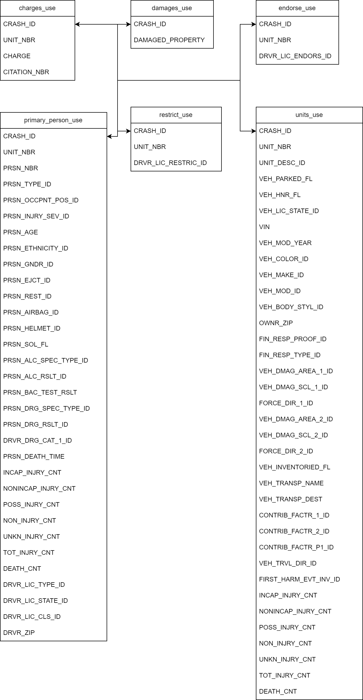

# Case_Study

## Project Description

Data Set folder has 6 csv files.

1. Charges_use.csv
2. Damages_use.csv
3. Endorse_use.csv
4. Primary_Person_use.csv
5. Restrict_use.csv
6. Units_use.csv

Here is the schema for the data:


## Project Questions

1. Find the number of crashes (accidents) in which the number of males killed is greater than 2.

2. How many two-wheelers are booked for crashes?

3. Determine the Top 5 Vehicle Makes of the cars present in the crashes in which the driver died and Airbags did not deploy.

4. Determine the number of Vehicles with drivers having valid licenses involved in hit and run.

5. Which state has the highest number of accidents in which females are not involved?

6. Which are the Top 3rd to 5th VEH_MAKE_IDs that contribute to the largest number of injuries, including death.

7. For all the body styles involved in crashes, mention the top ethnic user group of each unique body style.

8. Among the crashed cars, what are the Top 5 Zip Codes with the highest number of crashes with alcohol as the contributing factor to a crash (Use Driver Zip Code).

9. Count the Distinct Crash IDs where No Damaged Property was observed and Damage Level (VEH_DMAG_SCL~) is above 4 and the car has insurance.

10. Determine the Top 5 Vehicle Makes where drivers are charged with speeding-related offenses, have licensed drivers, used the top 10 used vehicle colors, and have cars licensed with the Top 25 states with the highest number of offenses (to be deduced from the data).

## Folder Structure

```
├───config
├───data
├───docs
├───notebooks
├───schema
├───scripts
├───src
│   ├───constants
│   ├───jobs
│   └───utils
└───tests
```

## How to run the project

1. **Clone the repository**
2. **Open the terminal and navigate to the project folder**
3. **Create a virtual environment and activate it**
   ```bash
   virtualenv venv
    source venv/bin/activate
   ```
4. **Install the dependencies**
   ```bash
   pip install -r requirements.txt
   ```
3. **Unzip or move all data files in the data folder**
3. **Run the following command:**
   ```bash
   make build  # To build the egg file
   make run    # To run the Spark job
   make help   # To display the available targets and their descriptions
   ```
4. **The results will be saved in the output folder**

## Author

[Deepanshu Tyagi](https://github.com/Brillianttyagi)

## Assumptions of output format
